
# Neversus

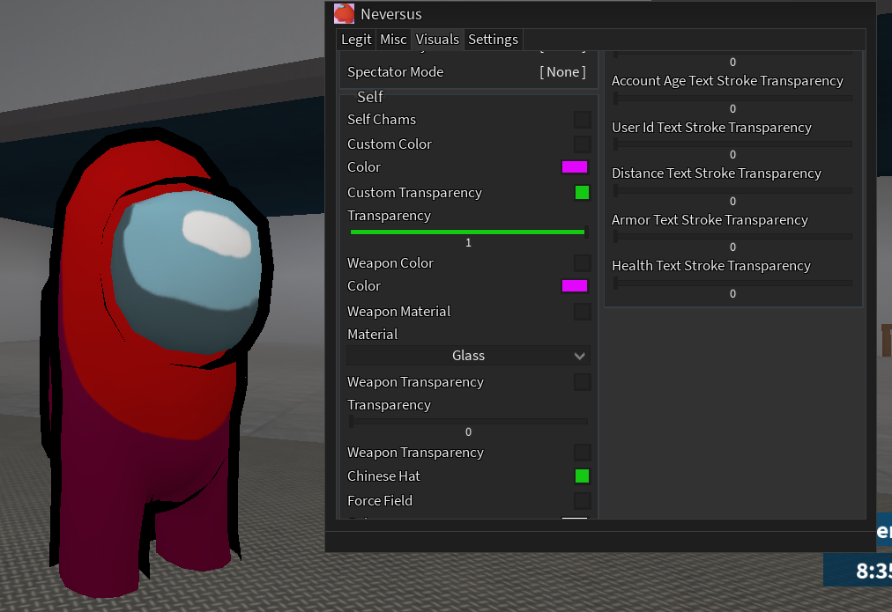
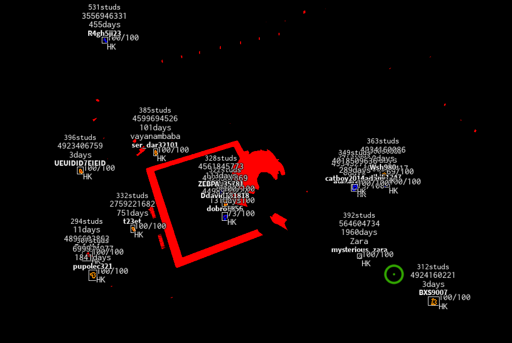

<b>Gameplay</b>

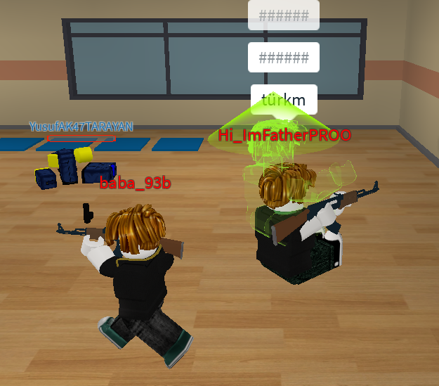
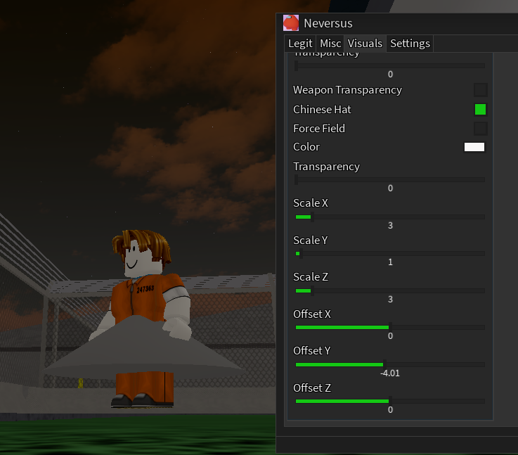

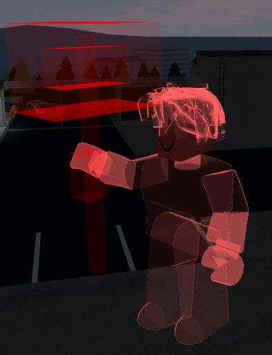
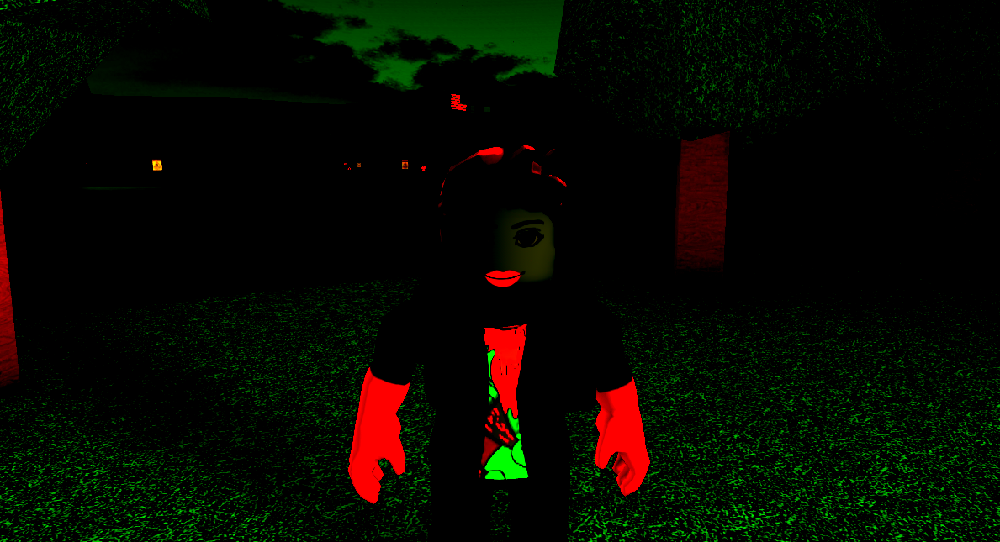

<b>Menu</b>

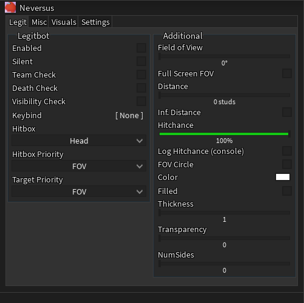
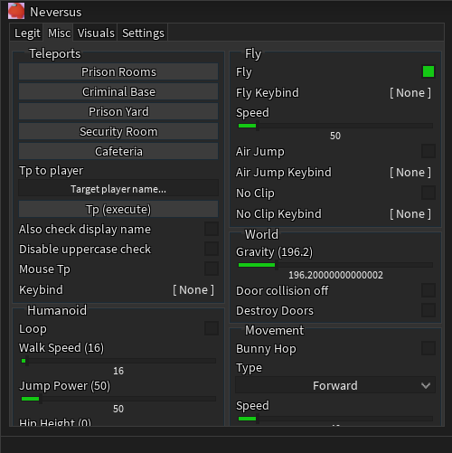
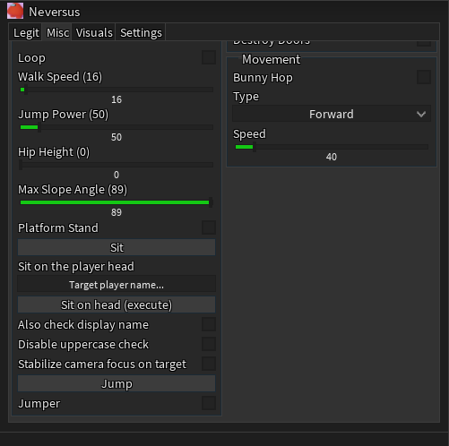

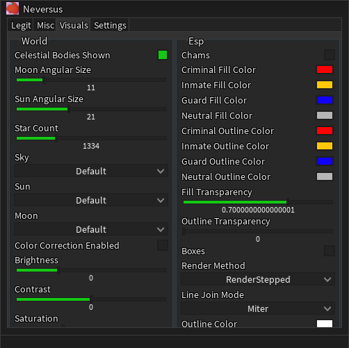
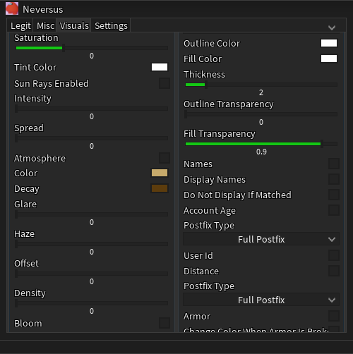
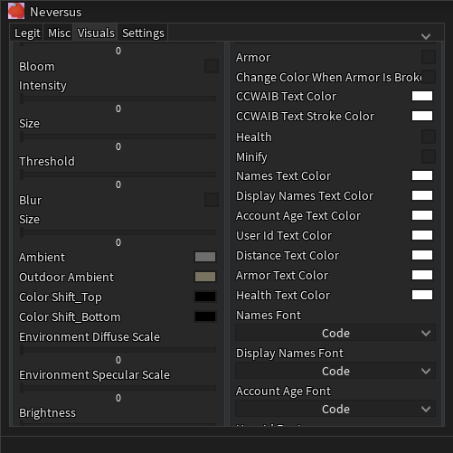

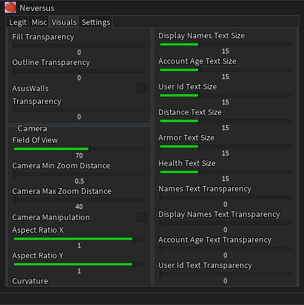
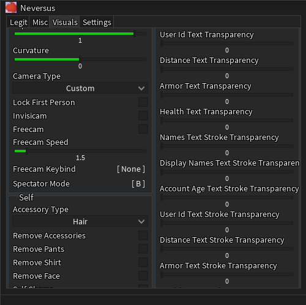
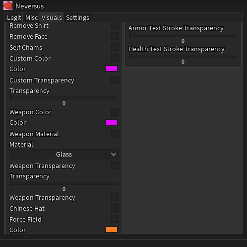
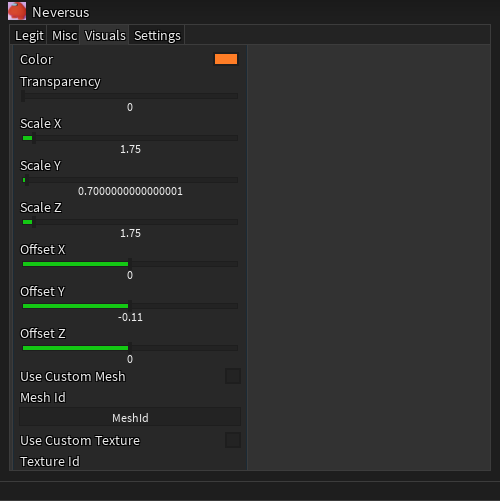
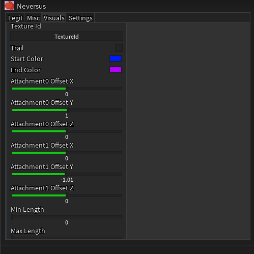
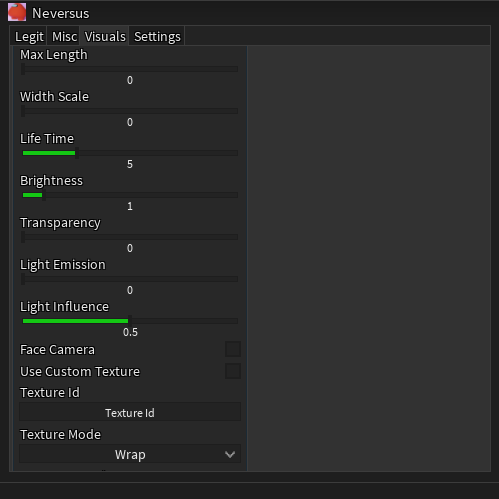
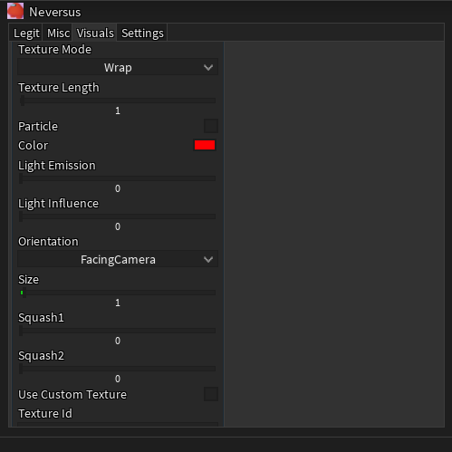
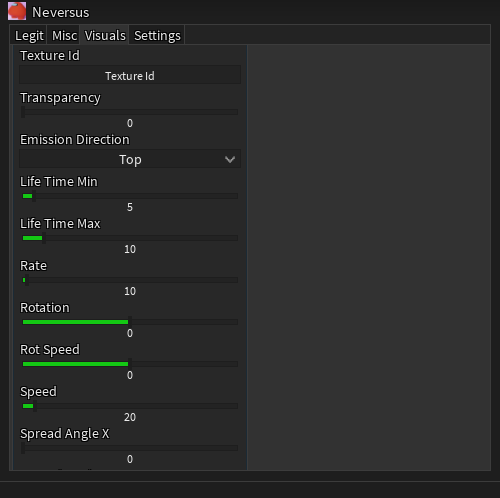
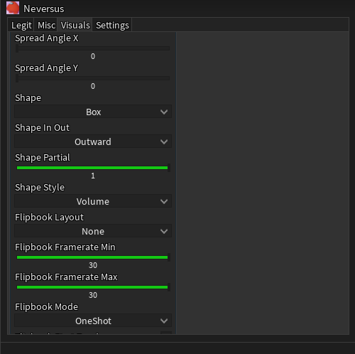
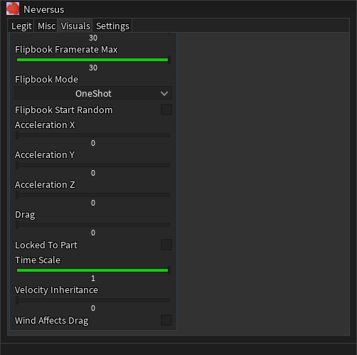

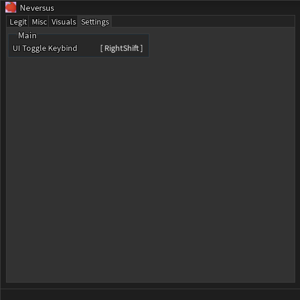
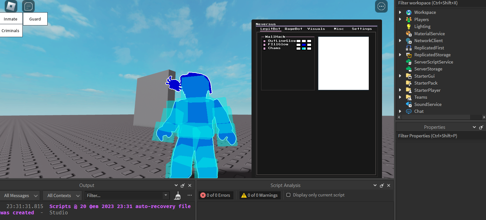

The most important project / cheat / script for Prison Life. Active development has been underway since early summer 2023 / 06.06.2023 18:00 (NeversusRebornV1). The very first appearance of the script was 24.02.2023 16:07 (Neversus24.02.20231607).

At the beginning of active development the visual component of the script was completely redirected towards the use of a free library on the basis of which the Hexagon script on Counter Blox playstyle was created (the first version of NeversusRebornV1 has no graphical interface). The original plan was not to use graphical libraries, but to create the script from scratch, but the development was too slow (and at that time I was inexperienced in GUI creation).

After resuming the process of writing the script, the Reborn prefix was added to the version/name, which was discarded after the first use, but still has value in the correlation between old and new versions. 
> [!CAUTION]
> At the end of the summer of 2023, the project was frozen (NeversusV2.8 is the latest release version(26.08.2023 21:42:33))

> [!IMPORTANT]
> It's been quite a while since I started this project, but now I can say that I won't be returning to it. So... Starting February 2, 2026, the repository will become a public project with an MIT license! I hope my code will help novice developers in exploiting Roblox games. Thank you to this community for sparking my interest in programming. I will miss you all ;)

###  Version history

- [NeversusV2.8](docs/NeversusV2.8.md) [26.08.2023 21:42:33]
- [NeversusV2.7.5](docs/NeversusV2.7.5.md) [20.08.2023 03:41:50]
- [NeversusV2.7.4](docs/NeversusV2.7.4.md) [16.08.2023 23:20:01]
- [NeversusV2.7.3](docs/NeversusV2.7.3.md) [12.08.2023 23:37:19]
- [NeversusV2.7.2.5](docs/NeversusV2.7.2.5.md) [11.08.2023 18:47:37]
- [NeversusV2.7.2](docs/NeversusV2.7.2.md) [11.08.2023 18:21:33]
- [NeversusV2.7.1](docs/NeversusV2.7.1.md) [09.08.2023 05:29:06]
- [NeversusV2.7](docs/NeversusV2.7.md) [08.08.2023 6:24:55]
- [NeversusV2.6.4](docs/NeversusV2.6.4.md) [29.07.2023 05:25:27]
- [NeversusV2.6.3](docs/NeversusV2.6.3.md) [29.07.2023 04:07:27]
- [NeversusV2.6.2](docs/NeversusV2.6.2.md) [26.07.2023 00:32:47]
- [NeversusV2.6.1](docs/NeversusV2.6.1.md) [25.07.2023 01:16:25]
- [NeversusV2.6](docs/NeversusV2.6.md) [07.07.2023 01:16:34]
- [NeversusV2.5](docs/NeversusV2.5.md) [06.07.2023 18:50:29]
- [NeversusV2.4](docs/NeversusV2.4.md) [27.06.2023 18:32:18]
- [NeversusV2.3](docs/NeversusV2.3.md) [15.06.2023 15:00:09]
- [NeversusV2.2](docs/NeversusV2.2.md) [12.06.2023 00:15:01]
- [NeversusV2.1](docs/NeversusV2.1.md) [11.06.2023 01:05:05]
- [NeversusV2](docs/NeversusV2.md) [10.06.2023 20:29:38]
- [NeversusRebornV1](docs/NeversusRebornV1.md) [06.06.2023 17:58:22]
- [Neversus26.02.20231231](docs/Neversus26.02.20231231.md) [26.02.2023 12:31]
- [Neversus25.02.20231208](docs/Neversus25.02.20231208.md) [25.02.2023 12:08]
- [Neversus24.02.20231607](docs/Neversus24.02.20231607.md) [24.02.2023 16:07]

*All versions between Neversus24.02.20231607 (24.02.23) and NeversusV2.8 (26.08.23) (inclusive) were committed based on their respective creation dates.*

